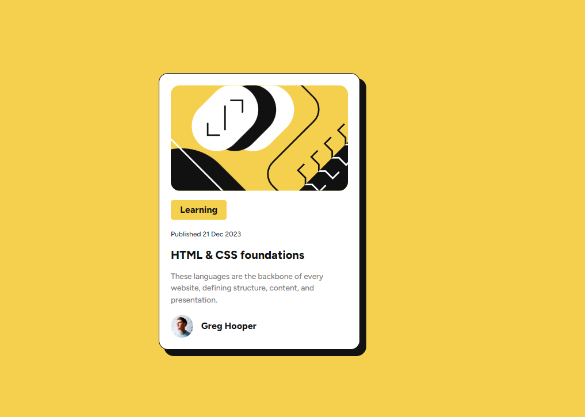

# Frontend Mentor - Blog preview card solution

This is a solution to the [Blog preview card challenge on Frontend Mentor](https://www.frontendmentor.io/challenges/blog-preview-card-ckPaj01IcS). Frontend Mentor challenges help you improve your coding skills by building realistic projects.

## Table of contents

- [Overview](#overview)
  - [The challenge](#the-challenge)
  - [Screenshot](#screenshot)
  - [Links](#links)
  - [Built with](#built-with)
- [Author](#author)

## Overview

### The challenge

Users should be able to:

- See hover and focus states for all interactive elements on the page

### Screenshot

### Links

- [Solution URL Here](https://github.com/ToastFreak777/Frontend-Mentor/tree/blog-preview-card)
- [Live Site](https://toastfreak777.github.io/Frontend-Mentor/blog-preview-card-main/)

### Built with

- Semantic HTML5 markup
- CSS custom properties
- Font-Face
- CSS Grid
- Mobile-first workflow

## Author

- Website - [ToastFreak](https://github.com/ToastFreak777)
- Frontend Mentor - [ToastFreak777](https://www.frontendmentor.io/profile/ToastFreak777)
